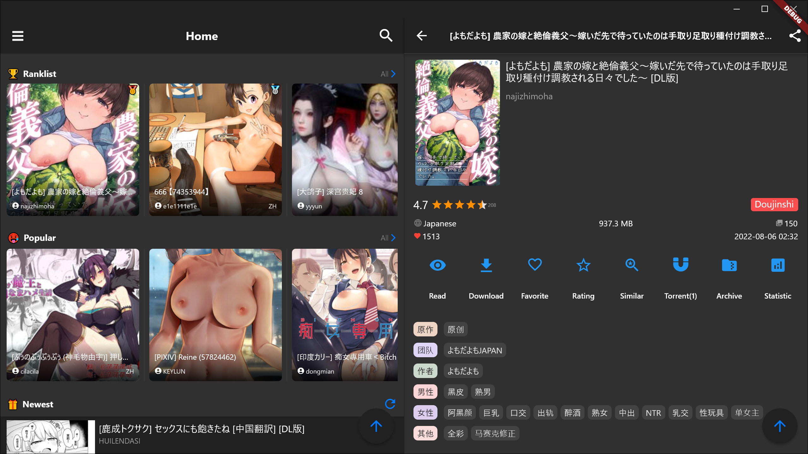

# JHenTai

English | [简体中文](https://github.com/jiangtian616/JHenTai/blob/master/README_cn.md)

## Description

An E-Hentai app for Android & iOS & Windows & MacOS & Linux.

Still in beginning stage, welcome to submit issues.

## Download & Install

[Download](https://github.com/jiangtian616/JHenTai/releases)

Install for Android: download .apk according to your device architecture and install.
- arm64-v8a：Suitable for Android phones with 8th generation ARM processor(common choice)
- armeabiv-v7a：Suitable for Android phones with 7th generation ARM processor
- x86_64：rare

Install for iOS: download .ipa, then use  [AltStore](https://altstore.io) or SideLoadly to sign.

Install for Windows: download Windows_xxx.zip, then unpack it. If you use a proxy server, set proxy address at network setting
page. If you're using Windows 11 and can't launch app, try to run jhentai.exe in compatibility mode. If it's blocked by Windows Defender,
Please trust it.

Install for MacOS: download .dmg. If you use a proxy server, set proxy address at network setting page.

Install for Linux(No maintenance): download Linux_xxx.zip, then unpack it. If you use a proxy server, set proxy address at network setting page.

## Help With Translation

Please submit a PR if you want to help with translation.

[steps](https://github.com/jiangtian616/JHenTai#Translation)

## Develop Motivation

My first project With Flutter. I aim at getting familiar with Flutter during development. Devices I use include Android
phone, Ipad and Windows computer. E-hentai apps I used before have several bugs, and I don't understand source code because I have no development
experience with Android or ios, so I choose JHenTai to become my first Flutter Project.

2022.08.20. After five months of development, JHenTai has gradually become more and more strong, and I have completely refactored some codes for gallery page, reading page, download, etc. 
which are written at the beginning stage. I tried my best to extract the commonality between different page and style to reduce coupling, 
in order to benefit the development of new features. I would be very grateful if any kind of you could give me some advice on coding style, 
design patterns and anything related to Flutter development or participate in the development of JHenTai.

## References & Thanks

Layout and style references:

- [FEhviewer](https://github.com/honjow/FEhViewer) : Mainly
- [EHPanda](https://github.com/tatsuz0u/EhPanda)
- [EHViewer](https://gitlab.com/NekoInverter/EhViewer)

Tag translation:

- [EhTagTranslation](https://github.com/EhTagTranslation/Database)

App translation：
- [andyching168](https://github.com/andyching168) 繁體中文(台灣)

mush thanks to these projects and people🙇‍

## Screenshots

### Mobile Layout V2

### Mobile Layout (Maintenance stopped)

### Tablet Layout V2

### Tablet Layout (Maintenance stopped)

### Desktop Layout

### Gallery & Search

  

### Gallery Detail

  

### Setting & Download

 

### Read

  

## Main Features

- [x] Mobile, tablet, desktop layout(5 kinds)
- [x] Vertical, horizontal, double column read page layout(4 kinds)
- [x] GalleryPage, Popular, Favorite, Watched, History, support multiple gallery list style
- [x] search, search suggestion, tap tag to search, file search, jump to a certain page
- [x] online reading and download, support restore download task, support synchronize updates after the uploader has
  uploaded a new version
- [x] archive download and automatic unpacking and reading
- [x] support loading local images and read
- [x] support assign priority to download task manually
- [x] support assign group to gallery and archive
- [x] favorite, rating, torrent, archive, statistics, share
- [x] password login, Cookie login, web login
- [x] support EX site(domain fronting optional)
- [x] vote for Tag, watch and hidden tags
- [x] comment, vote for comment
- [x] Fingerprint unlock
- [x] Support shortcut keys like 'Tab' and 'Arrow keys' in desktop layout

## Translation

> [languageCode](https://github.com/unicode-org/cldr/blob/master/common/validity/language.xml)
>
> [countryCode](https://github.com/unicode-org/cldr/blob/master/common/validity/region.xml)

1. Copy `/lib/src/l18n/en_US.dart ` and rename to `{your_languageCode}_{your_countryCode}.dart`
2. Rename classname in new file(optional)
3. Modify k-v pairs in method `keys` ,translate values to your language

Now you can submit your PR, I'll do the remaining things. Or you can go on with:
4. Enter `/lib/src/l18n/locale_text.dart ` , add a new k-v pair in method `keys`
   => `{your_languageCode}_{your_countryCode} : {your_className}.keys()`
5. Enter `/lib/src/consts/locale_consts.dart`, add a new k-v pair in
   property `localeCode2Description`: `{your_languageCode}_{your_countryCode} : {languageDescription}` to describe your language.

## Bug

1. Operations related to the clipboard may not work properly on Samsung devices due to a bug in Flutter itself.
2. Change download path to SD card is not supported now.

## About compiling

1. You need to manage your Android signing by yourself, check https://docs.flutter.dev/deployment/android#signing-the-app

## Main Dart Dependencies

- [get](https://pub.flutter-io.cn/packages/get): dependency management, state management, l18n, NoSQL
- [dio](https://pub.flutter-io.cn/packages?q=dio): network
- [extendedImage](https://pub.flutter-io.cn/packages/extended_image): image
- [drift](https://pub.flutter-io.cn/packages/drift): database
