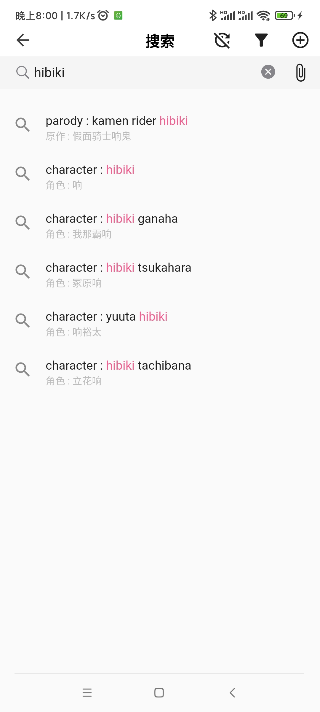
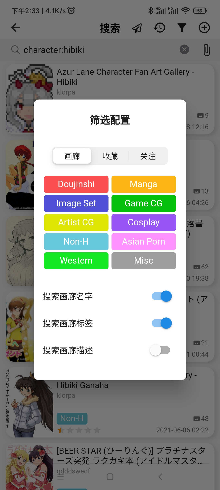

# JHenTai

[English](https://github.com/jiangtian616/JHenTai/blob/master/README.md) | 简体中文

## 定位

E-hentai 的一个多端app，现支持安卓、苹果和Windows系统。

仍在起步阶段，欢迎提交issue。

## 下载&安装

[下载](https://github.com/jiangtian616/JHenTai/releases)

安卓安装:  下载对应自己设置架构的apk文件，直接安装即可。

苹果安装:  下载ipa文件后，使用[AltStore](https://altstore.io)、SideLoadly、爱思助手等任一工具进行自签名。

Windows安装： 下载zip后解压即可。如果你使用了代理服务器，在网络设置里配置代理地址。

Mac安装： 下载dmg解压即可

## 开发动机

学习flutter的第一个练手项目，用来熟悉flutter的开发流程。

我自己平时主要使用安卓手机和Ipad，之前用的E站其他移动端App Bug较多，没接触过原生开发也改不动源码，就刚好选JHenTai来作为第一个项目。

## 参考与借鉴

布局样式参考:

- [FEhviewer](https://github.com/honjow/FEhViewer) : 主要
- [EHPanda](https://github.com/tatsuz0u/EhPanda)
- [EHViewer](https://gitlab.com/NekoInverter/EhViewer)

标签翻译数据库:

- [EhTagTranslation](https://github.com/EhTagTranslation/Database)

十分感谢以上项目🙇‍

## 截图

### 手机模式

### 平板模式

### 桌面模式

### 画廊页 & 搜索页

  

### 画廊详情页

  

### 设置 & 下载 & 阅读

  

## 主要功能

- [x] 支持手机、平板、桌面三种布局
- [x] 主页、热门、收藏、关注、历史，支持多种画廊样式
- [x] 搜索、搜索Tag提示、点击Tag快捷搜索、以图搜图、跳页
- [x] 在线阅读与下载，支持恢复下载记录，支持在上传者更新画廊后同步更新本地已下载的画廊
- [x] 支持下载归档并自动解压、阅读
- [x] 收藏、评分、磁力、归档、统计、分享
- [x] 账号密码登录、Cookie登录、Web登录
- [x] 支持域名前置直连里站
- [x] Tag翻译、Tag投票、关注Tag、隐藏Tag
- [x] 评论、评论投票
- [x] 指纹解锁
- [x] 桌面布局下支持通过按下Tab和方向键完成滚动、选中画廊等操作

## 功能Todo

## 优化Todo

- [ ] 另起isolate，专门负责下载

## 国际化步骤

> [languageCode](https://github.com/unicode-org/cldr/blob/master/common/validity/language.xml)
>
> [countryCode](https://github.com/unicode-org/cldr/blob/master/common/validity/region.xml)

1. 复制 `/lib/src/l18n/en_US.dart` 一份并重命名为`{your_languageCode}_{your_countryCode}.dart`

你可以只做这一步然后提交PR，我会补充其他的步骤，或者你自己可以继续：

2. 更改新文件的主类名字(可选)
3. 修改keys方法返回的所有键值对，将value翻译为你的语言
4. 在 `/lib/src/l18n/locale_text.dart` 的keys方法中增加一条键值对`{your_languageCode}_{your_countryCode} : {your_className}.keys()`
5. 在 `/lib/src/consts/locale_consts.dart` 的`localeCode2Description`
   属性中增加一条键值对`{your_languageCode}_{your_countryCode} : {languageDescription}`

## 已知bug

1. 阅读页面采取上下滚动方向时，有极小几率产生bug，导致无法正确读取当前页码；涉及第三方库。
2. 三星用户与剪切板相关的操作可能无法正常进行；为Flutter自身bug。

## 主要dart依赖

- [get](https://pub.flutter-io.cn/packages/get): 依赖管理、状态管理、国际化、NoSQL
- [dio](https://pub.flutter-io.cn/packages?q=dio): 网络
- [extendedImage](https://pub.flutter-io.cn/packages/extended_image): 图片
- [drift](https://pub.flutter-io.cn/packages/drift): 数据库
