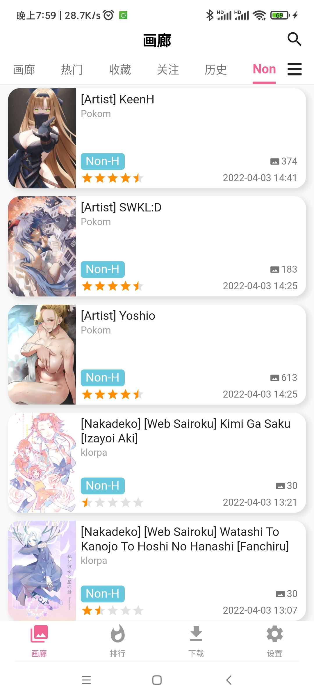
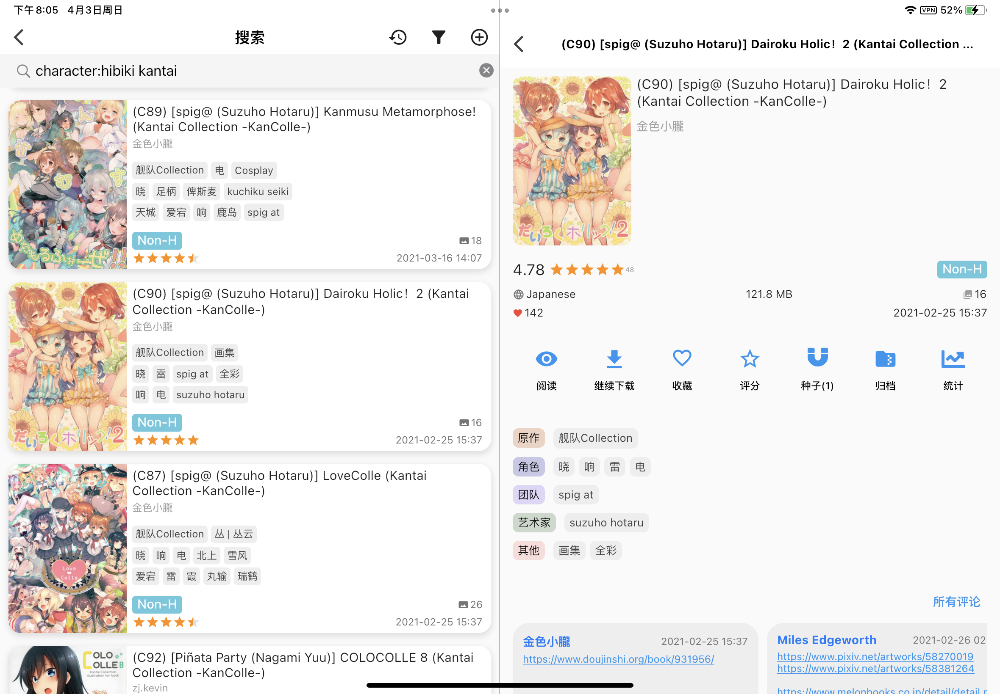
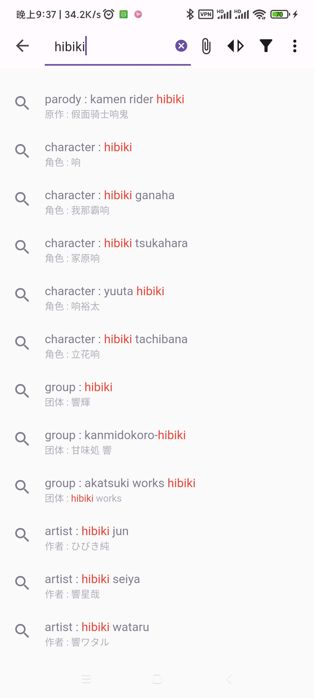
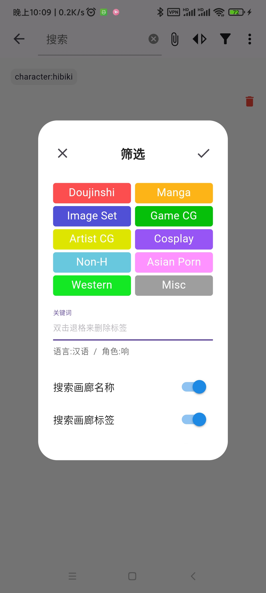
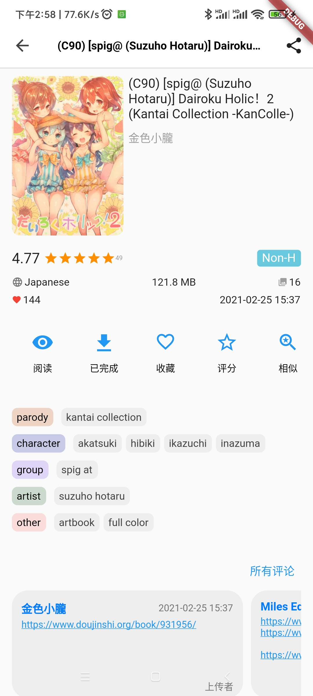
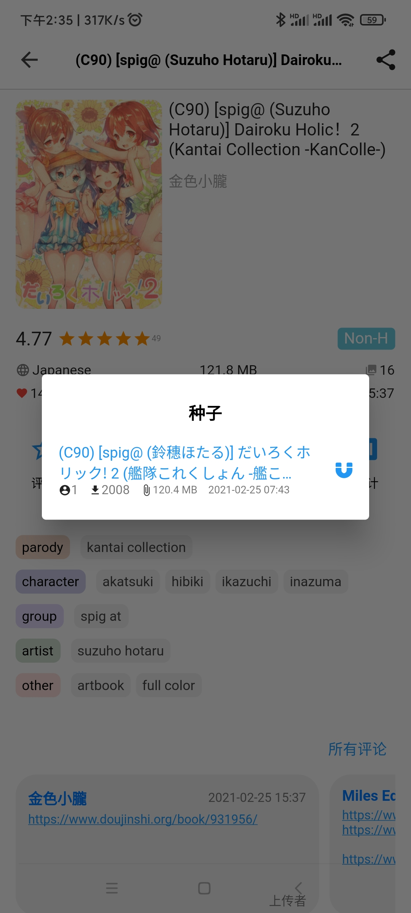
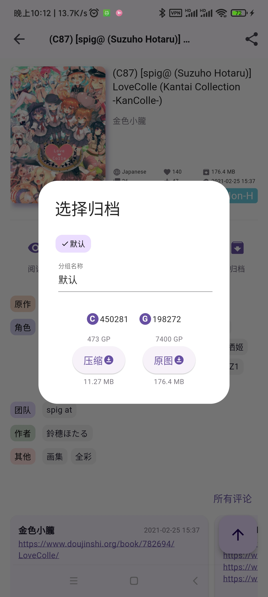
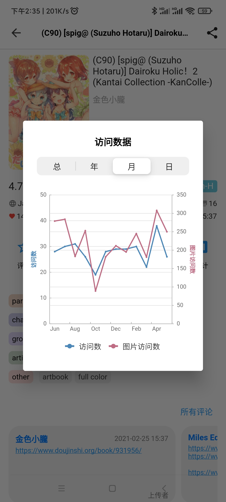
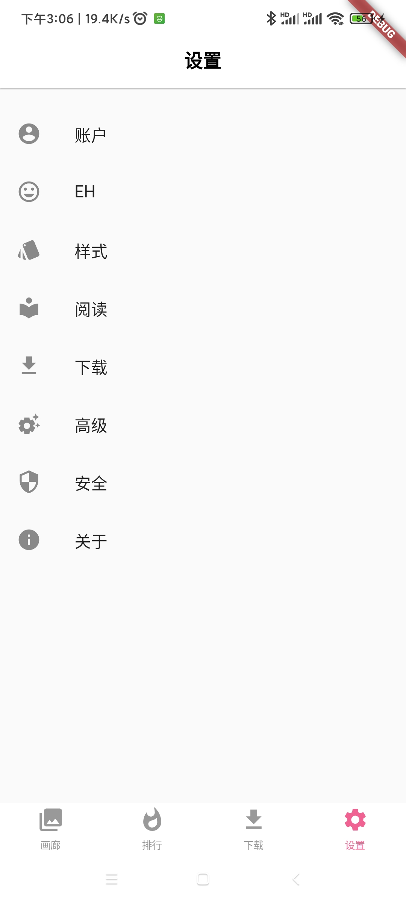
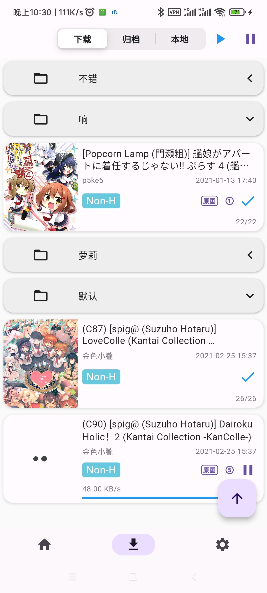

# JHenTai

[English](https://github.com/jiangtian616/JHenTai/blob/master/README.md) | 简体中文

## 定位

E-hentai 的一个多端app，现支持Android、iOS、Windows、MacOS和Linux系统。

仍在起步阶段，欢迎提交issue。

## 下载&安装

[下载](https://github.com/jiangtian616/JHenTai/releases)

安卓安装:  下载对应自己设置架构的apk文件，直接安装即可。
- arm64-v8a：适用于较新的第8代ARM处理器安卓手机(常见选择)
- armeabiv-v7a：适用于较老的第7代ARM处理器安卓手机
- x86_64：少见

苹果安装:  下载ipa文件后，使用[AltStore](https://altstore.io)、SideLoadly、爱思助手等任一工具进行自签名。

Windows安装： 下载Windows_xxx.zip后解压即可。如果你使用了代理服务器，在网络设置里配置代理地址。如果你使用的是Win11且出现打不开应用的情况，
请尝试右键更改jhentai.exe的属性，以兼容模式启动。如果Windows Defender报毒，请信任它。

Mac安装： 下载dmg解压即可。如果你使用了代理服务器，在网络设置里配置代理地址。

Linux安装（不维护）：下载Linux_xxx.zip后解压即可。如果你使用了代理服务器，在网络设置里配置代理地址。

## 开发动机

学习flutter的第一个练手项目，用来熟悉flutter的开发流程和模式。

我自己的使用设备包括安卓手机、iPad、Windows主机，之前用的E站其他App Bug较多，没接触过原生开发也改不动源码，就刚好选JHenTai来作为第一个项目。

2022.08.20 经过五个月的开发，现在JHenTai已经初具雏形，也逐渐对初期编写的不成熟的画廊页、阅读页、下载等代码进行了完全的重构，
尽力增内聚降耦合，方便新功能的开发。如果有同学能够对代码风格、设计模式、代码目录等Flutter开发相关进行指点，或者参与到JHenTai的开发中，我都会十分感谢。

## 借鉴与感谢

布局样式参考:

- [FEhviewer](https://github.com/honjow/FEhViewer) : 主要
- [EHPanda](https://github.com/tatsuz0u/EhPanda)
- [EHViewer](https://gitlab.com/NekoInverter/EhViewer)

标签翻译数据库:

- [EhTagTranslation](https://github.com/EhTagTranslation/Database)

App翻译：
- [andyching168](https://github.com/andyching168) 繁體中文(台灣)

十分感谢以上项目与人员🙇‍

## 截图

### 手机模式V2

### 手机模式旧 (已停止维护)

### 平板模式V2

### 平板模式旧 (已停止维护)

### 桌面模式

### 画廊页 & 搜索页

  

### 画廊详情页

  

### 设置 & 下载 

 

### 阅读

  

## 主要功能

- [x] 支持手机、平板、桌面三端共五种基础布局
- [x] 支持上下、左右、双列等共四种阅读布局
- [x] 主页、热门、收藏、关注、历史，支持多种画廊样式
- [x] 搜索、搜索Tag提示、点击Tag快捷搜索、以图搜图、跳页
- [x] 在线阅读与下载，支持恢复下载记录，支持在上传者更新画廊后同步更新本地已下载的画廊
- [x] 支持下载归档并自动解压、阅读
- [x] 支持读取本地图片，当作本地阅读器
- [x] 下载画廊支持手动调节任务优先级
- [x] 画廊和归档支持打上分组标签，统一展开折叠
- [x] 收藏、评分、磁力、归档、统计、分享
- [x] 账号密码登录、Cookie登录、Web登录
- [x] 支持域名前置直连里站
- [x] Tag翻译、Tag投票、关注Tag、隐藏Tag
- [x] 评论、评论投票
- [x] 指纹解锁
- [x] 桌面布局下支持通过按下Tab和方向键完成滚动、选中画廊等操作

## 国际化步骤

> [languageCode](https://github.com/unicode-org/cldr/blob/master/common/validity/language.xml)
>
> [countryCode](https://github.com/unicode-org/cldr/blob/master/common/validity/region.xml)

1. 复制 `/lib/src/l18n/en_US.dart` 一份并重命名为`{your_languageCode}_{your_countryCode}.dart`
2. 更改新文件的class name(可选)
3. 修改keys方法返回的所有键值对，将value翻译为你的语言

你可以只做以上步骤然后提交PR，我会补充其他的步骤，或者你自己可以继续：
4. 在 `/lib/src/l18n/locale_text.dart` 的keys方法中增加一条键值对`{your_languageCode}_{your_countryCode} : {your_className}.keys()`
5. 在 `/lib/src/consts/locale_consts.dart` 的 `localeCode2Description`
   属性中增加一条键值对`{your_languageCode}_{your_countryCode} : {languageDescription}`，用于描述你的语言

## 已知bug

1. 三星用户与剪切板相关的操作可能无法正常进行: 为Flutter自身bug。
2. 自定义下载路径不支持外置SD卡: Flutter自身尚未支持。

## 项目编译相关

1. 你需要自己管理安卓签名文件，见https://docs.flutter.dev/deployment/android#signing-the-app

## 主要dart依赖

- [get](https://pub.flutter-io.cn/packages/get): 依赖管理、状态管理、国际化、NoSQL
- [dio](https://pub.flutter-io.cn/packages?q=dio): 网络
- [extendedImage](https://pub.flutter-io.cn/packages/extended_image): 图片
- [drift](https://pub.flutter-io.cn/packages/drift): 数据库
