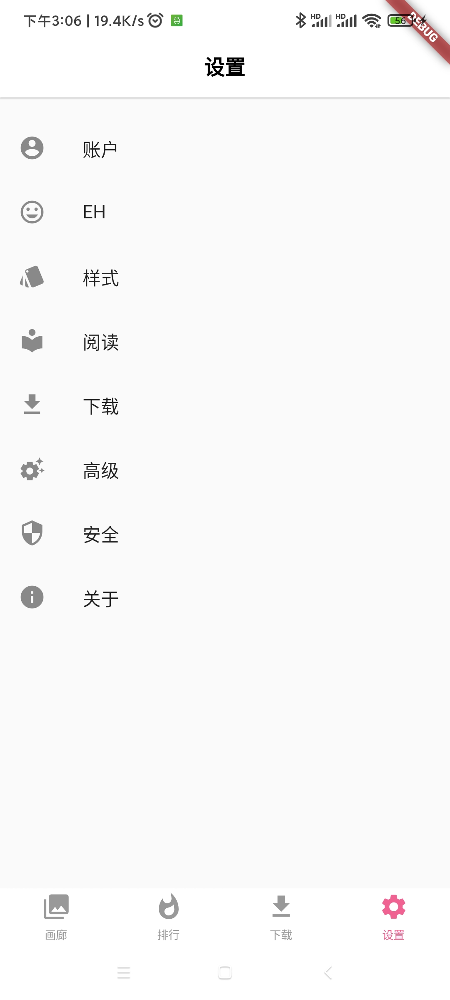

[](https://github.com/jiangtian616/JHenTai/releases)
[](https://github.com/jiangtian616/JHenTai/releases)

[](https://github.com/jiangtian616/JHenTai/issues/new)
[-brightgreen)](https://t.me/+PindoE9yvIpmOWI9)

# JHenTai

[English](https://github.com/jiangtian616/JHenTai/blob/master/README.md) | 简体中文
| [한국어](https://github.com/jiangtian616/JHenTai/blob/master/README_kr.md)

[常见问题，提问前必看](https://github.com/jiangtian616/JHenTai/wiki/%E5%B8%B8%E8%A7%81%E9%97%AE%E9%A2%98)

## 定位

E-hentai 的一个多端app，现支持Android、iOS、Windows、MacOS和Linux系统。

仍在发展阶段，十分欢迎提交各种bug反馈或Feature Request。

## 下载&安装

[](https://github.com/jiangtian616/JHenTai/releases)
[](https://apps.obtainium.imranr.dev/redirect?r=obtainium://app/%7B%22id%22%3A%22top.jtmonster.jhentai%22%2C%22url%22%3A%22https%3A%2F%2Fgithub.com%2Fjiangtian616%2FJHenTai%22%2C%22author%22%3A%22jiangtian616%22%2C%22name%22%3A%22JHenTai%22%2C%22preferredApkIndex%22%3A0%2C%22additionalSettings%22%3A%22%7B%5C%22includePrereleases%5C%22%3Afalse%2C%5C%22fallbackToOlderReleases%5C%22%3Atrue%2C%5C%22filterReleaseTitlesByRegEx%5C%22%3A%5C%22%5C%22%2C%5C%22filterReleaseNotesByRegEx%5C%22%3A%5C%22%5C%22%2C%5C%22verifyLatestTag%5C%22%3Afalse%2C%5C%22sortMethodChoice%5C%22%3A%5C%22date%5C%22%2C%5C%22useLatestAssetDateAsReleaseDate%5C%22%3Afalse%2C%5C%22releaseTitleAsVersion%5C%22%3Afalse%2C%5C%22trackOnly%5C%22%3Afalse%2C%5C%22versionExtractionRegEx%5C%22%3A%5C%22v(.*)%5C%22%2C%5C%22matchGroupToUse%5C%22%3A%5C%22%241%5C%22%2C%5C%22versionDetection%5C%22%3Atrue%2C%5C%22releaseDateAsVersion%5C%22%3Afalse%2C%5C%22useVersionCodeAsOSVersion%5C%22%3Afalse%2C%5C%22apkFilterRegEx%5C%22%3A%5C%22%5C%22%2C%5C%22invertAPKFilter%5C%22%3Afalse%2C%5C%22autoApkFilterByArch%5C%22%3Atrue%2C%5C%22appName%5C%22%3A%5C%22JHenTai%5C%22%2C%5C%22appAuthor%5C%22%3A%5C%22JTMonster%5C%22%2C%5C%22shizukuPretendToBeGooglePlay%5C%22%3Afalse%2C%5C%22allowInsecure%5C%22%3Afalse%2C%5C%22exemptFromBackgroundUpdates%5C%22%3Afalse%2C%5C%22skipUpdateNotifications%5C%22%3Afalse%2C%5C%22about%5C%22%3A%5C%22https%3A%2F%2Fgithub.com%2Fjiangtian616%2FJHenTai%2Fblob%2Fmaster%2FREADME.md%5C%22%2C%5C%22refreshBeforeDownload%5C%22%3Afalse%7D%22%2C%22overrideSource%22%3Anull%7D)


[](https://intradeus.github.io/http-protocol-redirector?r=altstore://source?url=https://raw.githubusercontent.com/jiangtian616/JHenTai/refs/heads/master/altsource/AltSource.json)
[](https://intradeus.github.io/http-protocol-redirector?r=sidestore://source?url=https://raw.githubusercontent.com/jiangtian616/JHenTai/refs/heads/master/altsource/AltSource.json)
[](https://intradeus.github.io/http-protocol-redirector?r=feather://source/https://raw.githubusercontent.com/jiangtian616/JHenTai/refs/heads/master/altsource/AltSource.json)

安卓安装:  下载对应自己设置架构的apk文件，直接安装即可。

- arm64-v8a：适用于较新的第8代ARM处理器安卓手机(常见选择)
- armeabiv-v7a：适用于较老的第7代ARM处理器安卓手机
- x86_64：少见

iOS安装:  下载ipa文件后，使用[AltStore](https://altstore.io)、SideLoadly、爱思助手等任一工具进行自签名。

- 你可以通过[ AltStore 订阅](https://intradeus.github.io/http-protocol-redirector?r=altstore://source?url=https://raw.githubusercontent.com/jiangtian616/JHenTai/refs/heads/master/altsource/AltSource.json)来获得更便捷的安装与更新体验

Windows安装： 下载Windows_xxx.zip后解压即可。

- 如果你使用了代理服务器，在网络设置里配置代理地址。
- 如果你使用的是Win11且出现打不开应用的情况， 请尝试右键更改jhentai.exe的属性，以兼容模式启动。
- 如果Windows Defender报毒，请信任它。

MacOS安装（不维护）： 下载dmg后安装即可。

- 在系统设置-安全性与隐私中信任应用
- 如果你使用了代理服务器，在网络设置里配置代理地址。

Linux安装（不维护）：根据你的系统选择 Linux-amd64.deb 或 Linux-x86_64.AppImage，下载后安装运行即可。(视需要你可能需要安装webkit2gtk-4.1)

基于 Fedora 的 dnf Linux 发行版：

```bash
sudo rpm --import https://meeks233.github.io/Jhentai-rpm/fedora/RPM-GPG-KEY-jhentai
sudo curl -fsSL -o /etc/yum.repos.d/jhentai.repo https://meeks233.github.io/Jhentai-rpm/fedora/jhentai.repo
sudo dnf install -y jhentai
```

- 如果你使用了代理服务器，在网络设置里配置代理地址。

## 更新

安卓更新： 下载对应自己设置架构的apk文件，直接覆盖安装即可。

iOS更新： 下载ipa文件后，使用[AltStore](https://altstore.io)、SideLoadly、爱思助手等任一工具进行自签名覆盖安装。

Windows更新： 直接删除旧的解压出来的文件夹，下载最新的Windows_xxx.zip后解压使用即可。

MacOS更新（不维护）： 直接删除旧包后，下载最新的包使用即可。

Linux更新（不维护）： 直接删除旧包后，下载最新的包使用即可。

## 开发动机

学习flutter的第一个练手项目，用来熟悉flutter的开发流程和模式。

我自己的使用设备包括安卓手机、iPad、Windows主机，之前用的E站其他App Bug较多，没接触过原生开发也改不动源码，就刚好选JHenTai来作为第一个项目。

2022.08.20 经过五个月的开发，现在JHenTai已经初具雏形，也逐渐对初期编写的不成熟的画廊页、阅读页、下载等代码进行了完全的重构，
尽力增内聚降耦合，方便新功能的开发。如果有同学能够对代码风格、设计模式、代码目录等Flutter开发相关进行指点，或者参与到JHenTai的开发中，我都会十分感谢。

2022.10.29 目前对于Flutter项目的基础开发已经较为熟悉，之后学习的主要精力会转向其他方向，JHenTai进入低频率更新时期，但仍会对bug或issue进行及时处理。

## 借鉴与感谢

布局样式参考:

- [FEhviewer](https://github.com/honjow/FEhViewer) : 主要
- [EHPanda](https://github.com/tatsuz0u/EhPanda)
- [EHViewer](https://gitlab.com/NekoInverter/EhViewer)

标签翻译数据库:

- [EhTagTranslation](https://github.com/EhTagTranslation/Database)

标签排序:

- [e-hentai-db](https://github.com/ccloli/e-hentai-db)
- [e-hentai-tag-count](https://github.com/mokurin000/e-hentai-tag-count)
- [EhSyringe](https://github.com/EhTagTranslation/EhSyringe)

App翻译：

- [andyching168](https://github.com/andyching168) [kenny03211](https://github.com/kenny03211) [NeKoOuO](https://github.com/NeKoOuO) 繁體中文(台灣)
- [lucas-04](https://github.com/lucas-04) 葡萄牙语 Português brasileiro
- [qlife1146](https://github.com/qlife1146) 韩语
- [bropines](https://github.com/bropines) Russian

十分感谢以上项目与人员🙇‍

## 截图

### 手机模式


### 平板模式


### 桌面模式


### 画廊页 & 搜索页

 

### 画廊详情页


### 设置 & 下载



### 阅读


## 主要功能

- [x] 支持手机、平板、桌面三端布局
- [x] 支持上下、左右、双列等共四种阅读布局
- [x] 主页、热门、收藏、关注、历史，支持多种画廊样式
- [x] 搜索、搜索Tag提示、点击Tag快捷搜索、以图搜图、跳页
- [x] 在线阅读与下载，支持恢复下载记录，支持在上传者更新画廊后同步更新本地已下载的画廊
- [x] 支持下载归档并自动解压、阅读
- [x] 支持读取本地图片，当作本地阅读器
- [x] 下载画廊支持手动调节任务优先级、下载分组、自定义排序
- [x] 画廊和归档支持打上分组标签，统一展开折叠
- [x] 收藏、评分、磁力、归档、统计、分享
- [x] 账号密码登录、Cookie登录、Web登录
- [x] 支持域名前置直连里站
- [x] Tag翻译、Tag投票、关注Tag、隐藏Tag
- [x] 评论、评论投票
- [x] 指纹解锁

## 国际化步骤

> [languageCode](https://github.com/unicode-org/cldr/blob/master/common/validity/language.xml)
>
> [countryCode](https://github.com/unicode-org/cldr/blob/master/common/validity/region.xml)

1. 复制 `/lib/src/l18n/en_US.dart` 一份并重命名为`{your_languageCode}_{your_countryCode}.dart`
2. 更改新文件的class name(可选)
3. 修改keys方法返回的所有键值对，将value翻译为你的语言

你可以只做以上步骤然后提交PR，我会补充其他的步骤，或者你自己可以继续：

4. 在 `/lib/src/l18n/locale_text.dart`
   的keys方法中增加一条键值对`{your_languageCode}_{your_countryCode} : {your_className}.keys()`
5. 在 `/lib/src/consts/locale_consts.dart` 的 `localeCode2Description`
   属性中增加一条键值对`{your_languageCode}_{your_countryCode} : {languageDescription}`，用于描述你的语言

## 项目编译相关

1. 你需要自己管理安卓签名文件，见https://docs.flutter.dev/deployment/android#signing-the-app
2. 使用IDEA或者VSCode直接运行即可

## 主要dart依赖

- [get](https://pub.flutter-io.cn/packages/get): 依赖管理、状态管理、国际化、NoSQL
- [dio](https://pub.flutter-io.cn/packages?q=dio): 网络
- [extendedImage](https://pub.flutter-io.cn/packages/extended_image): 图片
- [drift](https://pub.flutter-io.cn/packages/drift): 数据库
