

# JHenTai

English | [简体中文](https://github.com/jiangtian616/JHenTai/blob/master/README_cn.md) | [한국어](https://github.com/jiangtian616/JHenTai/blob/master/README_kr.md)

[Q&A](https://github.com/jiangtian616/JHenTai/wiki/Common-Questions)

## 개요

Android & iOS & Windows & MacOS & Linux를 지원하는 E-Hentai 애플리케이션.

아직 개발 중입니다. 오류 제보나 기능 요청은 언제나 환영합니다.

## 다운로드 & 설치

[다운로드](https://github.com/jiangtian616/JHenTai/releases)

Android 설치: 사용자의 디바이스 아키텍처에 맞는 .apk 파일을 다운로드 후 설치하세요.

- arm64-v8a：8세대 ARM 프로세서를 탑재한 안드로이드 폰에 해당됨(일반적인 선택)
- armeabiv-v7a：7세대 ARM 프로세서를 탑재한 안드로이드 폰에 해당됨
- x86_64：희귀함

iOS 설치: [AltStore](https://altstore.io)나 SideLoadly를 이용해 .ipa 파일을 다운로드하고 접속하세요.

Windows 설치: download Windows_xxx.zip 파일을 다운로드하고 압축 해제를 하세요. 만약 프록시 서버를 이용한다면 네트워크 설정에서 프록시 주소를 설정해 주세요. Windows 11을 사용하는데 앱 실행이 되지 않는다면 호환성 모드를 켠 상태에서 실행해 보세요. Windows Defender에 차단된 경우라면 허용으로 바꿔주세요.

MacOS 설치: .dmg 파일을 다운로드합니다. 만약 프록시 서버를 이용한다면 네트워크 설정에서 프록시 주소를 설정해 주세요.

Linux(지원 중지): Linux_xxx.zip 파일을 다운로드하고 압축 해제를 하세요. 만약 프록시 서버를 이용한다면 네트워크 설정에서 프록시 주소를 설정해 주세요.

## 개발 동기

저의 첫 Flutter 프로젝트입니다. 저는 개발 중에 Flutter에 익숙해지는 것을 목표로 합니다. 제가 사용하는 기기는 Android 폰, iPad, Windows 컴퓨터입니다. 기존 E-hentai 앱들은 버그가 있고, Android, iOS의 개발 경험이 없어서 소스 코드를 이해할 수도 없어서 JHenTia를 제 첫 Flutter 프로젝트로 정했습니다.

2022.08.20 JHenTai는 5개월의 개발 기간을 거치며 점점 견고해졌고 초기 단계에서 작성된 갤러리 페이지, 보기 페이지, 다운로드 등의 일부 코드를 완전히 리팩토링했습니다. 새로운 기능 개발에 도움이 되도록 서로 다른 페이지와 스타일 간의 공통점을 추출해 결합을 줄이도록 노력했습니다. 코딩 스타일, 디자인 패턴 등 Flutter 개발에 관한 조언을 해주시거나 JHenTai 개발에 참여해 주시면 정말 감사하겠습니다.

2022.10.29 저는 이제 기본적인 Flutter 개발에 더 익숙해졌고 앞으로는 다른 영역에 집중할 것입니다. 그래서 JHenTai의 업데이트는 전보다는 줄어들겠지만 버그나 오류는 제때 처리하겠습니다.

## 참조 & 감사의 말씀

레이아웃과 스타일 참조:

- [FEhviewer](https://github.com/honjow/FEhViewer) : 메인
- [EHPanda](https://github.com/tatsuz0u/EhPanda)
- [EHViewer](https://gitlab.com/NekoInverter/EhViewer)

태그 번역:

- [EhTagTranslation](https://github.com/EhTagTranslation/Database)

앱 번역:

- [andyching168](https://github.com/andyching168) 繁體中文(台灣)
- [lucas-04](https://github.com/lucas-04) Português brasileiro
- [qlife1146](https://github.com/qlife1146) 한국어

위의 프로젝트와 인원에게 감사드립니다🙇‍

## 스크린샷

### 모바일 레이아웃

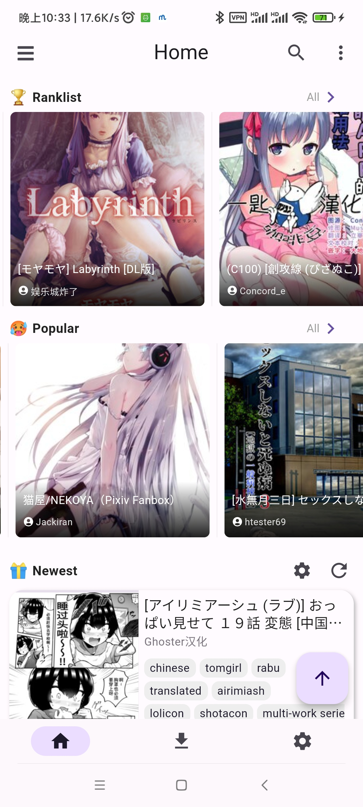

### 태블릿 레이아웃

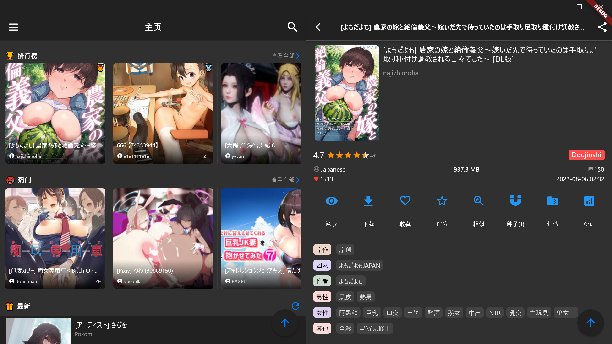

### 데스크톱 레이아웃

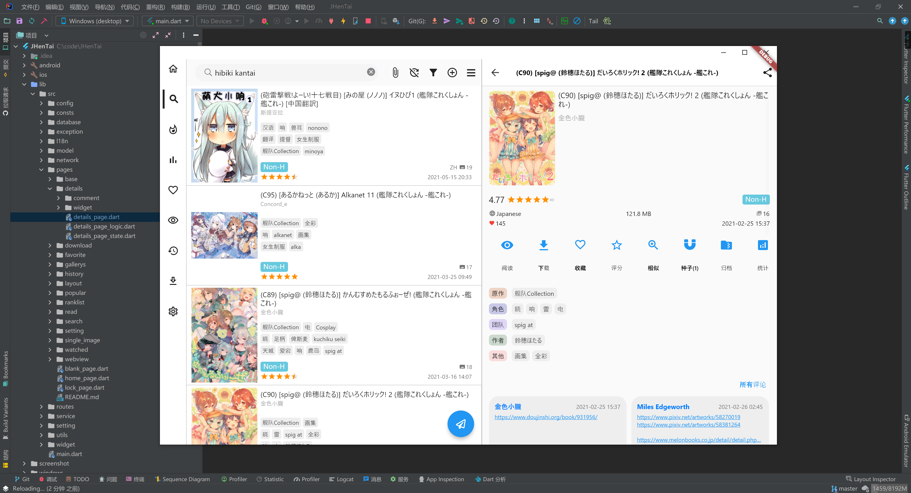

### 갤러리 & 검색

 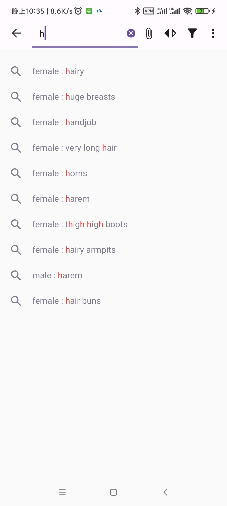 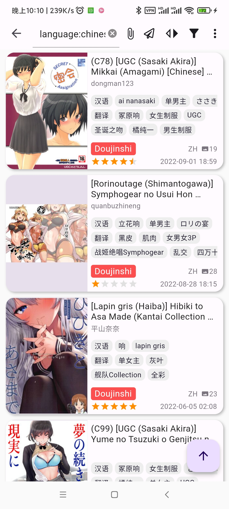
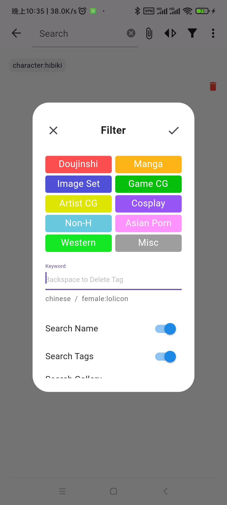

### 갤러리 세부 정보

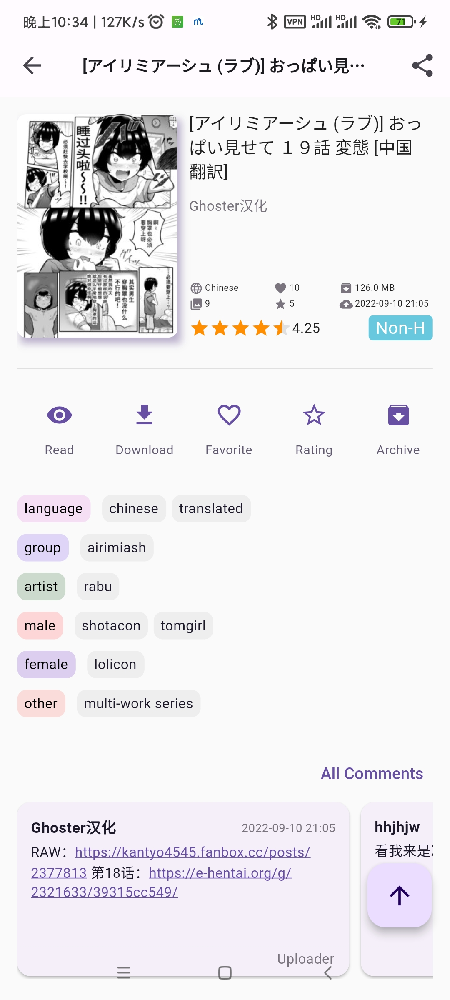  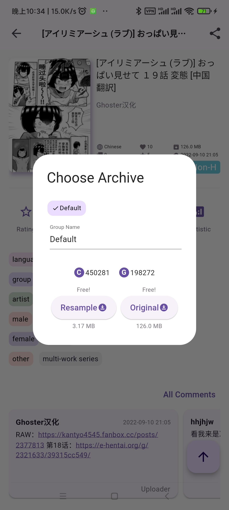
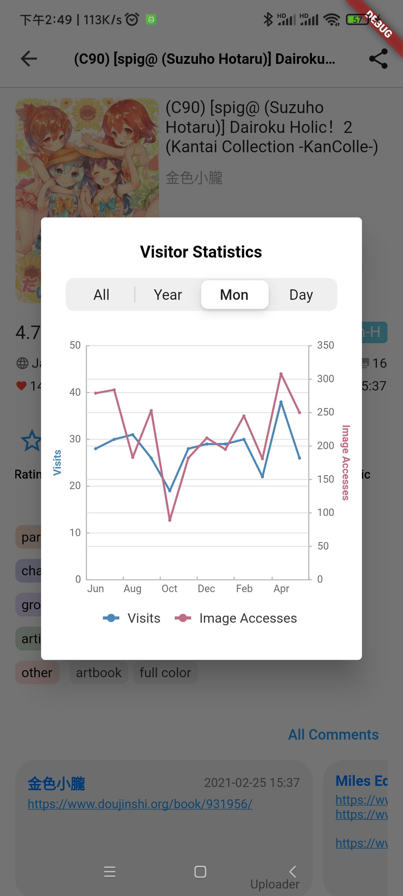

### 설정 & 다운로드

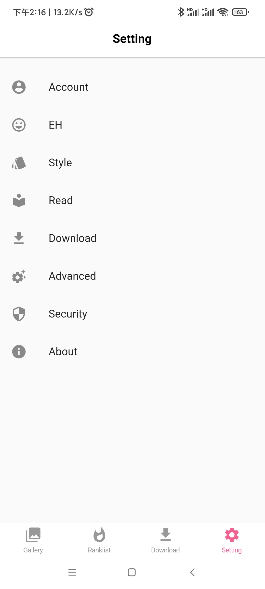 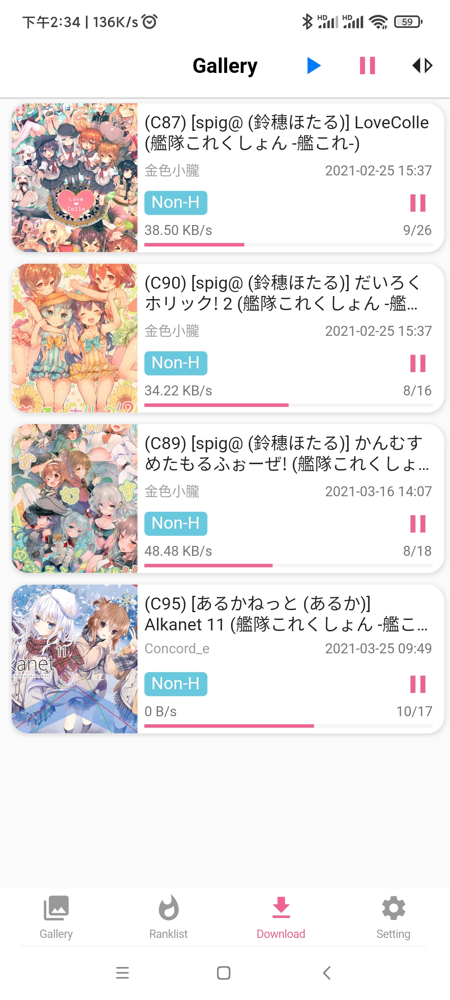

### 보기

  

## 주 기능

- [x] 모바일, 태블릿, 데스크톱 레이아웃(세 종류)
- [x] 가로, 세로 각각 두 쪽 레이아웃(네 종류)
- [x] 갤러리 페이지, 인기 있음, 즐겨찾기, 본 적 있음, 기록에 서로 다른 갤러리 목록 스타일 지원
- [x] 검색, 검색 추천, 태그를 눌러 검색, 파일 검색, 특정 페이지로 이동
- [x] 온라인 보기 및 다운롣, 다운로드 작업 복원 지원, 업로더가 새로운 버전을 업로드했을 때 업데이트 동기화 지원
- [x] 아카이브 다운로드, 자동 압축 해제 후 보기
- [x] 로컬 이미지 불러오기 및 보기 지원
- [x] 다운로드 작업 우선순위 수동 지정 지원
- [x] 갤러리 및 아카이브에 그룹 설정 지원
- [x] 즐겨찾기, 점수, 토렌트, 아카이브, 통계, 공유
- [x] 암호 로그인, 쿠키 로그인, 웹 로그인
- [x] EX 사이트 지원(도메인 프론팅은 선택사항)
- [x] 태그 추천/비추천, 태그 강조/숨김
- [x] 댓글, 댓글 추천
- [x] 지문 잠금 해제
- [x] 데스크톱 레이아웃에서 '탭 키'와 '화살표 키' 등의 바로 가기 키 지원

## 번역

> [언어 코드](https://github.com/unicode-org/cldr/blob/master/common/validity/language.xml)
>
> [지역 코드](https://github.com/unicode-org/cldr/blob/master/common/validity/region.xml)

1. `/lib/src/l18n/en_US.dart`를 복사 후 이름을 `{사용자의_언어_코드}_{사용자의_지역_코드}.dart`로 바꾸세요
2. 새 파일의 클래스명을 바꾸세요(선택 사항)
3. 메서드 `keys`에서 k-v 쌍을 수정하고, 값을 사용자 언어로 번역하세요

여기까지 한 후에 풀 리퀘스트를 제출하시면 나머지 작업은 제가 합니다. 아니면 다음 사항을 계속 진행하셔도 됩니다:

4. `/lib/src/l18n/locale_text.dart`에 들어간 후, 새로운 k-v 쌍을 메서드 `keys`에 추가하세요.
   => `{사용자의_언어_코드}_{사용자의_지역_코드} : {사용자의_클래스명}.keys()`
5. Enter `/lib/src/consts/locale_consts.dart`에 들어간 후, `localeCode2Description` 속성에 새로운 k-v 쌍을 추가하세요 : `{사용자의_언어_코드}_{사용자의_지역_코드} : {언어 설명}` 형식으로 사용자 언어의 설명을 작성하세요.

## 버그

1. Flutter 자체 버그로 인해 삼성 기기에서 클립보드와 관련된 작업이 제대로 작동하지 않을 수 있습니다.
2. 다운로드 경로를 SD 카드로 변경하는 것은 현재 지원되지 않습니다.

## 컴파일 정보

1. Android 서명을 직접 관리하려면 다음 사이트를 확인하세요: https://docs.flutter.dev/deployment/android#signing-the-app

## Dart 주요 종속성

- [get](https://pub.flutter-io.cn/packages/get): 종속성 관리, 상태 관리, l18n, NoSQL
- [dio](https://pub.flutter-io.cn/packages?q=dio): 네트워크
- [extendedImage](https://pub.flutter-io.cn/packages/extended_image): 이미지
- [drift](https://pub.flutter-io.cn/packages/drift): 데이터베이스
